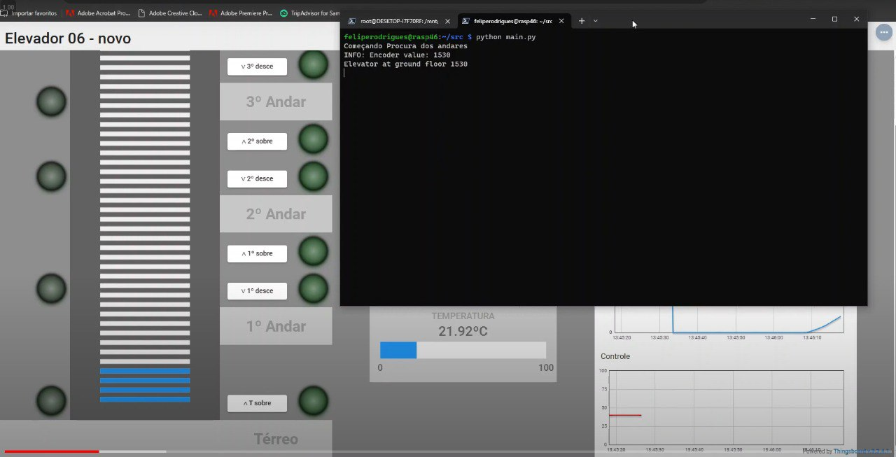
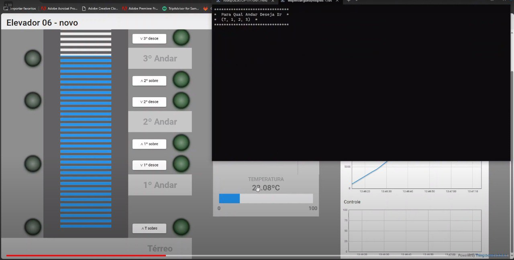
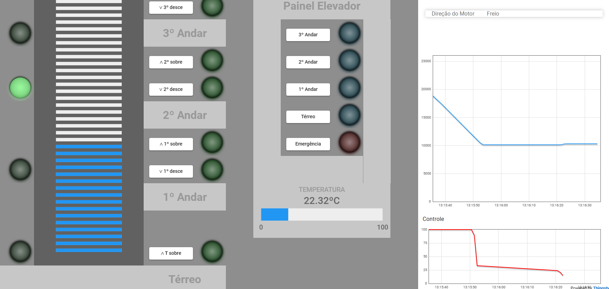

- **Aluno:** Felipe Alef Pereira Rodrigues
- **Matrícula:** 19/0042532
# Trabalho 2 (2023-2)

## 1. Instruções para Execução
Primeiro, clone o repositório e mova a diretório `src` para um dos dispositivos Raspberry.

Na base do projeto, rode o comando abaixo:

```bash
$ python3 src/main.py
```

## 2 Video do trabalho
[link do video](https://youtu.be/V9FoRrTyJYU)

## 3 Sobre o trabalho

Primeiro o elevador irá subir para calibrar os andares, então quando o sensor do andar for ativado irá mandar a UART solicitar o valor do encoder daquele andar

Após finalizar a calibragem a thread de atualizar a temperatura ambiente a cada 1 segundo irá começar assim como um menu onde a pessoa irá escolher o andar que deseja ir

ao colocar o andar desejado o elevador irá, com a ajuda do PID, para o andar desejado

